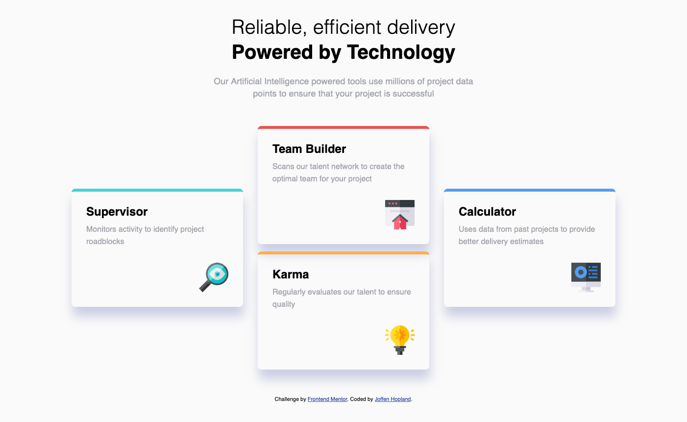
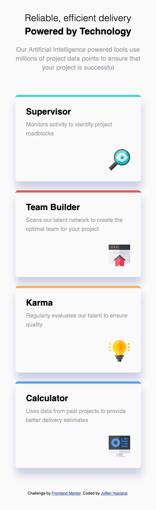

# Frontend Mentor - Four card feature section solution

This is a solution to the [Four card feature section challenge on Frontend Mentor](https://www.frontendmentor.io/challenges/four-card-feature-section-weK1eFYK). Frontend Mentor challenges help you improve your coding skills by building realistic projects.

## Table of contents

- [Overview](#overview)
  - [The challenge](#the-challenge)
  - [Screenshot](#screenshot)
  - [Links](#links)
- [My process](#my-process)
  - [Built with](#built-with)
  - [What I learned](#what-i-learned)
  - [Continued development](#continued-development)
- [Author](#author)

## Overview

### The challenge

Users should be able to:

- View the optimal layout for the site depending on their device's screen size

### Screenshot

### Links

- Live Site URL: [https://joffenhopland.github.io/four-card-feature-sec](https://joffenhopland.github.io/four-card-feature-sec)

### My process

### Built with

- Semantic HTML5 markup
- CSS custom properties
- Flexbox
- Mobile-first workflow

### What I learned

To make the layout of the box section I used flexbox. But to stack the two boxes in the center I had to place them inside of a div. Then I used align-items: center; to center the boxes on the sides.

### Continued development

Keep getting more comfortable with flexbox.

## Author

- Frontend Mentor - [@joffenhopland](https://www.frontendmentor.io/profile/Joffenhopland)
